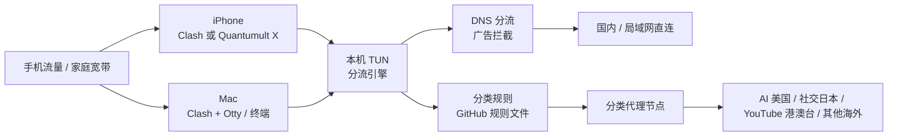

# 网络拓扑图

> 当前设计只在 iPhone 和 Mac 上启用代理，不修改路由器，不作为局域网网关。

## 关键约束

- iPhone 同时只能启用 Clash 或 Quantumult X 一个 VPN 隧道。
- AI 自动组只在美国节点内自动选择。
- 社交自动组只在日本节点内自动选择。
- 流媒体自动组只在香港/台湾节点内自动选择。
- 其他海外自动组才允许在全部国家节点中自动选择。
- 代理不可用时阻断，不回退直连。
- GitHub 只提供规则和模板，不保存真实订阅。
